# Dashboard widgets

What each widget type shows, what it is good for, and what each of its settings does. To change a setting, press "Edit" on the dashboard, then the pencil on the widget. Every data widget also has "Widget name", "Unit" (shown with the values, like orders or %) and "Size" ("Small (a square)", "Medium", "Wide", "Large", or "Keep as is" when editing).

Editing dashboard files by hand, or asking an AI to? Use `AI-WIDGET-GUIDE.md` in this folder.

## Line chart and bar chart

*Sample: a line chart of orders per day, with a dashed goal line. Every number in the samples is invented.*

<picture>
  <source media="(prefers-color-scheme: dark)" srcset="docs/images/widget-line-dark.png">
  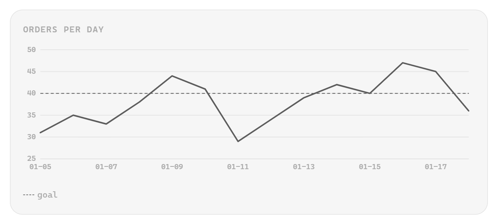
</picture>

*Sample: a bar chart of orders per week, web and shop stacked.*

<picture>
  <source media="(prefers-color-scheme: dark)" srcset="docs/images/widget-bar-dark.png">
  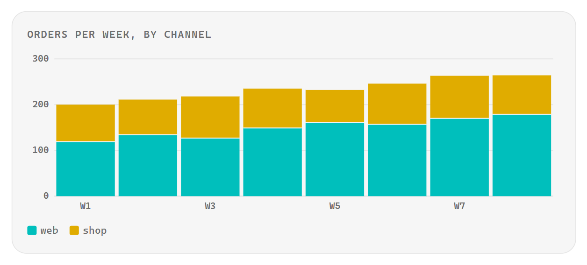
</picture>

**What it shows:** how a number changes over time or across groups, as a line or as bars.

**Good for:**
- Revenue per day, with a guide line at break-even.
- Pages read per week against a reading goal.
- Visits to a site per day, split by source.
- Open tasks per project, one bar each.

**What the query returns:** one column for along the bottom (usually a date) and one or more number columns. A line chart, bar chart or one big number can also be built by picking a table and a column, and the plugin writes the query.

| Panel label | What it does | Default |
| --- | --- | --- |
| "X column" | The column along the bottom. Rows draw in the order the query returns them. | |
| "Y columns (comma-separated)" | The number column, or several for several lines or bars. | |
| "Stack the bars on top of each other" | A bar chart with two or more Y columns: stacks them. | Off |
| "Stack the series on top of each other" | The same, for a bar chart built by picking a column to split by. | Off |
| "Compare with" | Built charts only. Draws an earlier period faintly behind: "No comparison", "Previous period", "Same period last year". | "No comparison" |
| "Good direction" | Which way the change counts as good: "Up is good", "Down is good (costs, open tasks)". | "Up is good" |

Shared: colours and scrub line, change and roll-up, axis, guide lines and zones, band (line only), hint and footnote.

## Bars and lines (combo)

*Sample: orders per month as bars, with the return rate as a dashed line on the right axis.*

<picture>
  <source media="(prefers-color-scheme: dark)" srcset="docs/images/widget-combo-dark.png">
  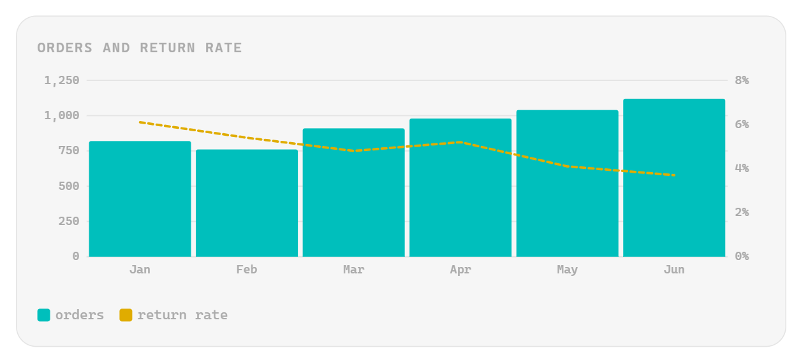
</picture>

**What it shows:** bars and lines on one chart, each on a left or right scale.

**Good for:**
- Monthly spending as bars, with the share of budget used as a line.
- Orders as bars, with the return rate as a dashed line on the right.
- Tasks finished per week as bars, with a running total as a line.
- Site visits as bars, with the sign-up rate on the right.

**What the query returns:** one column for along the bottom and one number column per series.

| Panel label | What it does | Default |
| --- | --- | --- |
| "X column" | The column along the bottom. | |
| "Series" | One row per series, up to 8, added with "+ Add series". | |
| "Stack the bars on top of each other" | Stacks two or more bar series. They must share one axis. | Off |

Each series row has:

| Row field | What it does | Default |
| --- | --- | --- |
| column | The query column it draws. | |
| drawn as | "Bars" or "Line". | First row Bars, the rest Line |
| axis | "Left axis" or "Right axis". | "Left axis" |
| colour | See colours. | "Theme default" |
| name in the legend | The series' name in the legend. | "legend name (optional)": the column name |
| opacity | How see-through, 0 to 1. | "opacity 1" |
| dash | Line only. "solid, or like 4 3": 4 drawn, 3 left out. | Solid |
| join across empty rows | Line only. Draws the line across rows with no value. | Off |

Shared: scrub line colour, axis (as "Left axis" and "Right axis"), guide lines and zones, hint and footnote.

## Scatter chart

*Sample: a scatter chart of orders against ad spend, coloured by channel, with a trend line.*

<picture>
  <source media="(prefers-color-scheme: dark)" srcset="docs/images/widget-scatter-dark.png">
  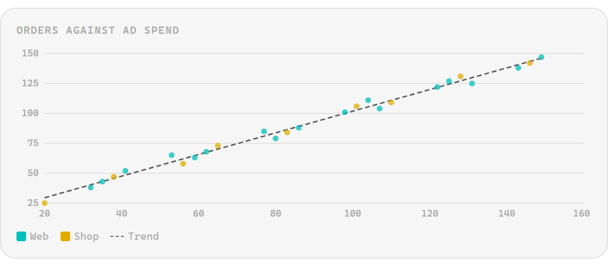
</picture>

**What it shows:** how two numbers move together, one point for each row.

**Good for:**
- Orders against ad spend, one point per day.
- Sleep hours against the next day's mood.
- Pages read against minutes read, coloured by book.
- Price against rating, with a trend line.

**What the query returns:** one row per point: a number for along the bottom, a number for up the side, and optionally a column to colour by. A row with no number in either column is left out.

| Panel label | What it does | Default |
| --- | --- | --- |
| "X column" | The number along the bottom. | |
| "Y column" | The number up the side. | |
| "Colour the points by column" | One colour for each value of the column: the four most common, the rest together as Other. "No colouring" keeps one colour. | "No colouring" |
| "Draw a trend line through the points" | The straight line that fits all the points best (least squares). | Off |

Shared: point colour, axis (with "Lowest x value" and "Highest x value"), guide lines and zones, hint and footnote.

## Bullet chart

*Sample: a bullet chart of sales against target by region, shaded by value levels.*

<picture>
  <source media="(prefers-color-scheme: dark)" srcset="docs/images/widget-bullet-dark.png">
  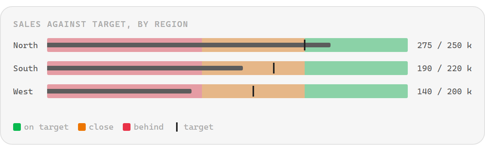
</picture>

**What it shows:** for each row, a bar for the actual value against a mark for its target, on one scale shaded in bands like poor, fair and good.

**Good for:**
- Sales per region against target.
- Hours slept per night against a goal of eight.
- Spend per category against budget.
- Pages read per book against its length.

**What the query returns:** one row per bar, up to 12: a label, the actual number and, for a target mark, the target number. All the bars share one scale, so give them one unit, or write each as a percent of its target.

| Panel label | What it does | Default |
| --- | --- | --- |
| "Label column" | Names each bar. "No labels" draws the bars alone. | "No labels" |
| "Actual value column" | The number each bar is as long as. | |
| "Target column" | The number each target mark sits at. "No target" draws no marks. | "No target" |
| "Lowest value on the scale" | Where the scale starts. Automatic: zero, or the lowest value when something is below zero. | "automatic" |
| "Highest value on the scale" | Where the scale ends; a bigger value is drawn at the end. Automatic: the largest value, target or band end, on a round number. | "automatic" |

The bands behind the bars are the value levels: each range is drawn as a band, in its level's colour.

Shared: value levels, hint and footnote.

## One big number

*Sample: one big number, orders this month, with a caption line, a meter and a level.*

<picture>
  <source media="(prefers-color-scheme: dark)" srcset="docs/images/widget-stat-dark.png">
  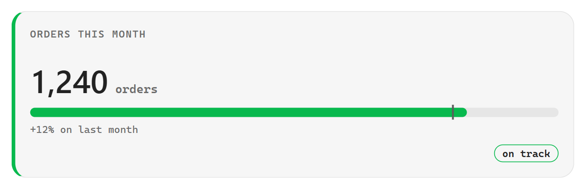
</picture>

**What it shows:** one number, large, with optional small lines under it.

**Good for:**
- Sales this month.
- Books finished this year.
- Budget left, coloured red when it runs low.
- The current streak on a habit.

**What the query returns:** one row. The number comes from one column; caption lines can come from others.

| Panel label | What it does | Default |
| --- | --- | --- |
| "Value column" | Which column of the first row is the number. | "The first column" |
| "Caption columns (comma-separated)" | Up to 4 columns shown as small lines under the number. | "empty: the next column" |

Shared: number size, value levels, meter, hint and footnote.

## Table

*Sample: a table of orders by channel, with a sparkline column for the last 14 days.*

<picture>
  <source media="(prefers-color-scheme: dark)" srcset="docs/images/widget-table-dark.png">
  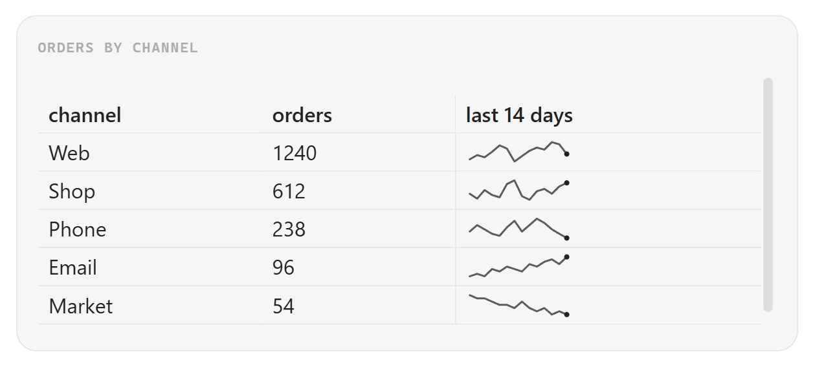
</picture>

**What it shows:** the query's rows, as written. A column can show as a sparkline: a tiny line chart in each row, one line to a cell.

**Good for:**
- The last ten orders.
- Overdue tasks with their projects.
- Books in progress and the page you are on.
- The top pages on a site this week, each with its visits per day as a sparkline.

**What the query returns:** any rows and columns. A sparkline column holds a short series of numbers in each cell, written like 3,5,4,8: the query builds it with `group_concat` (the AI guide has the pattern).

| Panel label | What it does | Default |
| --- | --- | --- |
| "Sparkline columns (comma-separated)" | The columns to draw as a tiny line chart, up to 8. Each line has its own scale, lowest to highest, with a dot on the last value. A cell with fewer than two numbers shows as the text it is. | "empty: no sparklines" |

Shared: hint and footnote.

## Part-to-whole bar (segments)

*Sample: a part-to-whole bar of tasks by status.*

<picture>
  <source media="(prefers-color-scheme: dark)" srcset="docs/images/widget-segments-dark.png">
  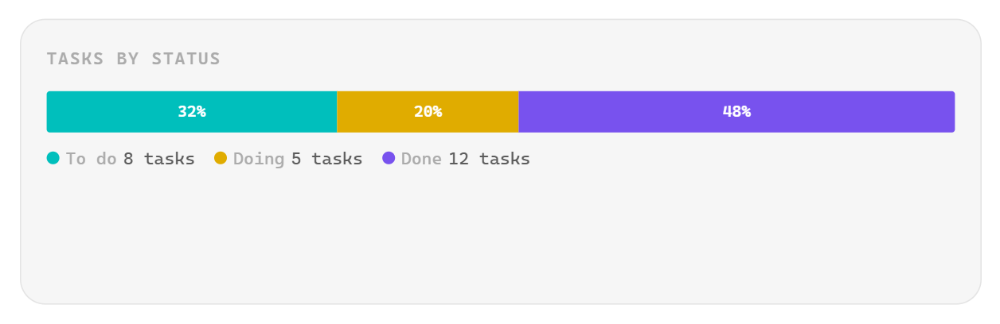
</picture>

**What it shows:** one bar split into parts, each as wide as its share of the total.

**Good for:**
- Tasks by status: to do, doing, done.
- This month's spending by category.
- Site visits by device.
- Reading time by genre.

**What the query returns:** one row per part, in order: a name column and a number column.

| Panel label | What it does | Default |
| --- | --- | --- |
| "Part name column" | The column that names each part. | |
| "Part size column" | The number column that sizes each part. | |
| "Part colours" | A colour per part, matched to the part's name exactly. Up to 12. Each row has "part name" and "colour". "+ Add part colour" adds one; "+ A row for each part in the preview" adds one for every part without a colour. | "Theme colour": the theme's colours in turn |

Shared: value levels, hint and footnote.

## Pie or doughnut chart

*Sample: a doughnut chart of orders by channel, with its legend.*

<picture>
  <source media="(prefers-color-scheme: dark)" srcset="docs/images/widget-pie-dark.png">
  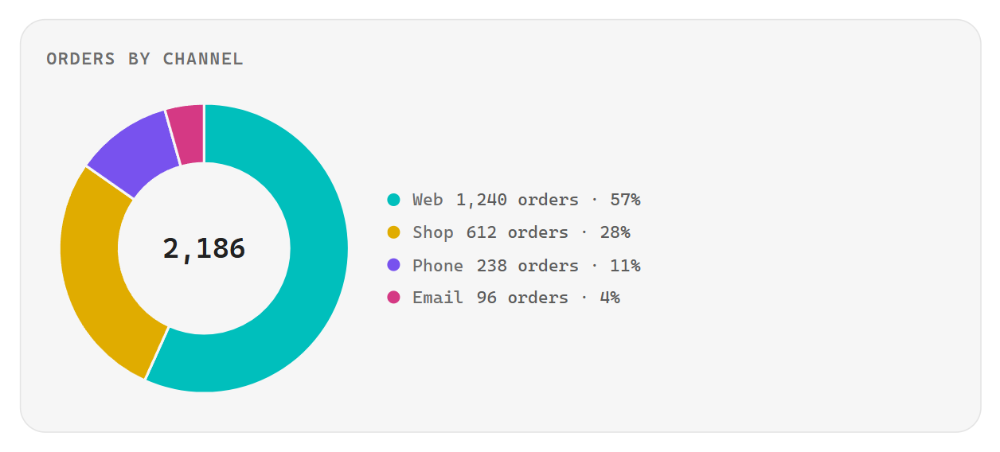
</picture>

**What it shows:** a circle split into slices, each as big as its share of the total, starting at twelve o'clock and going clockwise in the order of the rows. A legend names every part with its value and share.

**Good for:**
- Orders by channel.
- This month's spending by category.
- Time by project, when a few big parts matter more than small differences.

**What the query returns:** one row per part, in order: a name column and a number column. Use a part-to-whole bar when there are many small parts; a pie reads best with five or fewer.

| Panel label | What it does | Default |
| --- | --- | --- |
| "Part name column" | The column that names each part. | |
| "Part size column" | The number column that sizes each part. | |
| "Cut a hole in the middle (a doughnut)" | Draws a doughnut and writes the total in the hole. | Off: a full pie |
| "Part colours" | A colour per part, as on the part-to-whole bar. | "Theme colour": the theme's colours in turn |

Shared: value levels, hint and footnote. The theme has five series colours; from the sixth part on, parts share one faint colour, so group small parts in the query.

## Heatmap

*Sample: a heatmap of orders by weekday and hour, coloured by value levels.*

<picture>
  <source media="(prefers-color-scheme: dark)" srcset="docs/images/widget-heatmap-dark.png">
  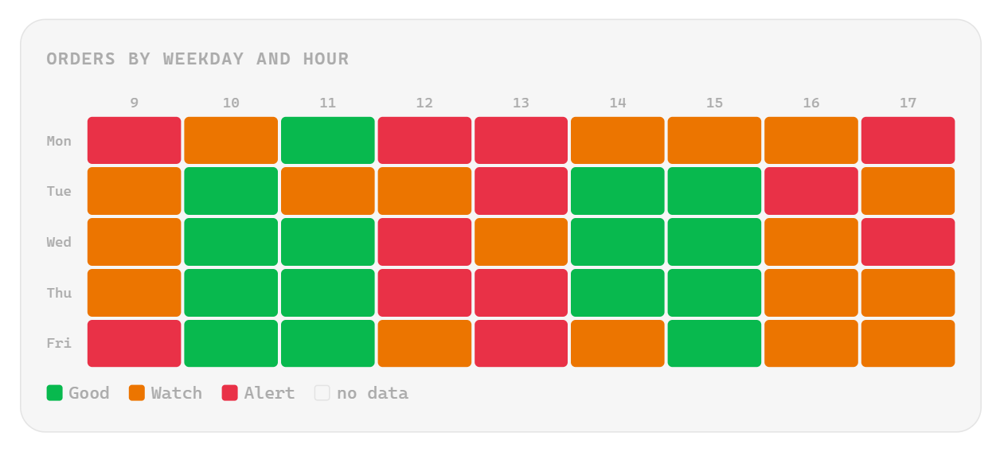
</picture>

**What it shows:** a grid of cells, each coloured by its value.

**Good for:**
- Minutes worked by day and hour, with a dot on hours with a meeting.
- Habits done by day of the week.
- Site visits by weekday and hour.
- Spending by category and month.

**What the query returns:** one row per cell: a row label, a column label and a number.

| Panel label | What it does | Default |
| --- | --- | --- |
| "Row labels column" | Names each row of the grid. | |
| "Column labels column" | Names each column of the grid. | |
| "Cell value column" | The number that colours the cell. Without value levels every cell is grey. | |

The group "Dots, highlight, cells and labels":

| Panel label | What it does | Default |
| --- | --- | --- |
| "Dot column" | A cell gets a dot where this column is not empty, 0 or false. | "No dots" |
| "Dot colour" | The dot's colour. | "Theme default" |
| "Dot label in the legend" | The dot's name in the legend. | "empty: the column name" |
| "Highlight" | Lights up the present: "The current hour’s column (columns named 0 to 23)", "Today’s row or column (named like 2026-01-31)", "Today’s weekday (named like Monday or Mon)". | "None" |
| "Cells" | "Thin rows (default)", "Square", "Fill the tile’s height". | Thin rows |
| "Label every Nth column" | 3 labels every third column. | "empty: every column" |

Shared: value levels, hint and footnote.

## Year calendar

*Sample: a year calendar of orders per day, coloured by value levels.*

<picture>
  <source media="(prefers-color-scheme: dark)" srcset="docs/images/widget-calendar-dark.png">
  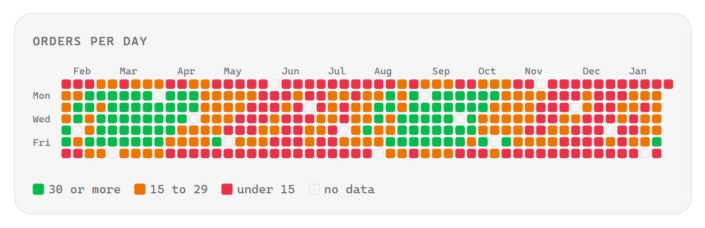
</picture>

**What it shows:** a year at a glance: one square for each day, a week to a column, each coloured by its value.

**Good for:**
- Days a habit was kept, like a contribution graph.
- Orders or visits per day across a year.
- Sleep hours per night, coloured by how restful.
- Days with a workout, a purchase or a headache.

**What the query returns:** one row per day: a date written like 2026-01-31 and a number. A day with no row stays empty. Without value levels every day with data is grey.

| Panel label | What it does | Default |
| --- | --- | --- |
| "Date column" | The day of each row, written like 2026-01-31 (a time after it is ignored). | |
| "Day value column" | The number that colours the day. | |
| "Week starts on" | "The plugin setting (default)", "Sunday" or "Monday": the day each column of weeks starts on. The plugin setting "Week starts on" (Settings, then this plugin) is the default for every calendar; pick Sunday or Monday here to override it for this widget. | "The plugin setting (default)" |
| "Year" | Shows that whole calendar year, like 2026. | "empty: the last 53 weeks up to the newest day" |

Shared: value levels, hint and footnote.

## Text

*Sample: a text widget with two short paragraphs.*

<picture>
  <source media="(prefers-color-scheme: dark)" srcset="docs/images/widget-text-dark.png">
  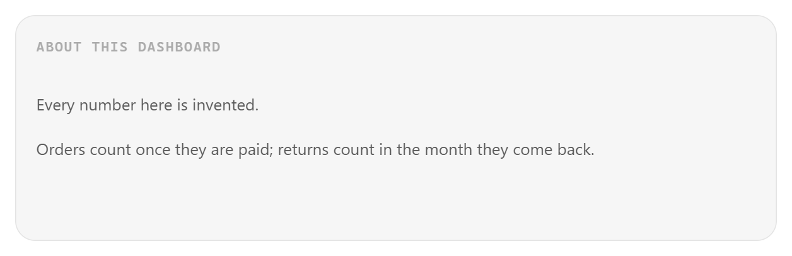
</picture>

**What it shows:** plain words on the dashboard, written by you or filled from a query.

**Good for:**
- A note on what a section of the dashboard means.
- "Data through" and the newest date, filled from a query.
- This week's focus for a project.
- A reading goal, written once.

**What the query returns:** one value, from the first column of the first row. Written text runs no query.

| Panel label | What it does | Default |
| --- | --- | --- |
| "Widget type" | "Text", "Section divider" or "A widget with data". | |
| "The words come from" | "Written here" or "A query (its first column, first row)". | "Written here" |
| "Text" | The words, up to 2,000 characters. Plain text, not Markdown. | |
| "SQL" | The query, when the words come from one. | |
| "One thin line, like a section divider (no title)" | One slim strip of text in a thin row. | Off |
| "Title" | Not on a thin line. | "no title" |
| "Width" | A thin line's width: "Full width", "Half", "A third", "One cell". | "Full width" |

Shared: hint and footnote.

## Section divider

*Sample: a section divider with the heading Sales.*

<picture>
  <source media="(prefers-color-scheme: dark)" srcset="docs/images/widget-divider-dark.png">
  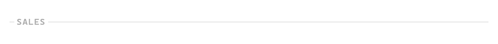
</picture>

**What it shows:** a thin line with an optional heading that separates groups of widgets.

**Good for:**
- Splitting a dashboard into Sales and Costs.
- One heading per project.
- Keeping this week apart from this year.
- Grouping reading, habits and budget on one page.

**What the query returns:** nothing. It runs no query.

| Panel label | What it does | Default |
| --- | --- | --- |
| "Widget type" | "Section divider", "Text" or "A widget with data". | |
| "Heading" | The words on the line. | Empty |
| "Width" | "Full width", "Half", "A third", "One cell". | "Full width" |

No shared settings.

## Settings shared by several widgets

| Setting | Line | Bar | Combo | Scatter | Bullet | One big number | Table | Segments | Heatmap | Calendar | Text |
| --- | --- | --- | --- | --- | --- | --- | --- | --- | --- | --- | --- |
| Colours and scrub line | Yes | Bar colour | Scrub line | Point colour | | | | | | | |
| Number size | | | | | | Yes | | | | | |
| Value levels | | | | | Bands | Yes | | Yes | Yes | Yes | |
| Change and roll-up | One series | One series | | | | | | | | | |
| Meter | | | | | | Yes | | | | | |
| Sparklines | | | | | | | Yes | | | | |
| Axis | Yes | Yes | Left and right | Side and bottom | | | | | | | |
| Guide lines and zones | Yes | Yes | Yes | Yes | | | | | | | |
| Band | SQL only | | | | | | | | | | |
| Hint and footnote | Yes | Yes | Yes | Yes | Yes | Yes | Yes | Yes | Yes | Yes | Yes |

### Colours and scrub line

| Panel label | What it does | Default |
| --- | --- | --- |
| "Line colour" | A one-series line chart's line. | "Theme default" |
| "Bar colour" | A one-series bar chart's bars. | "Theme default" |
| "Point colour" | A scatter chart's points, when they are not coloured by a column. | "Theme default" |
| "Scrub line colour" | Line chart or combo: the thin line that follows your pointer. | "Theme default" |

Every colour list offers "Theme default"; the theme's "Green (theme)", "Amber (theme)", "Red (theme)", "Yellow (theme)", "Cyan (theme)", "Blue (theme)", "Purple (theme)", "Pink (theme)" (in a row of fields just "Green", "Amber", "Red", "Yellow", "Cyan", "Blue", "Purple", "Pink"), which follow light and dark mode; and "Custom colour", which opens a colour picker. A zone's list starts at "Pick a colour".

### Number size

| Panel label | What it does | Default |
| --- | --- | --- |
| "Number size" | "Small (24 px)", "Medium (34 px)", "Large (48 px)", "Extra large (64 px)", "Shrink to fit" (shrinks until the number shows whole), or "Custom". | "Theme default" |
| "Number size in pixels" | With "Custom": a whole number from "12 to 120". | |

### Value levels

Value levels colour a widget by where its number lands, like Good, Watch and Alert. The levels' names and colours live in the plugin settings; each widget sets its own ranges. The first range that holds the number wins.

| Panel label | What it does | Default |
| --- | --- | --- |
| "Value levels" | One row per range: "from" and "to" ("lowest value (empty for no limit)", "highest value (empty for no limit)", both ends inside), "level", and "pill text (optional)": "short text shown as a pill (optional)" by the title. "+ Add range" adds one; "+ Anything else" adds a last range that catches every other number. | No ranges |
| "Judge the ranges on column" | One big number, segments and pie: judge on another column of the first row, like a score. On segments and pie its "None (needed when there are ranges)" must be changed once ranges exist. | "empty: the shown value" |
| "Colours for this widget" | Changes a level's colour on this widget only: "Settings colour", a theme colour or "Custom colour". A changed level reads "Changed for this widget"; "Reset to settings" undoes it. | "Settings colour" |

### Change and roll-up

| Panel label | What it does | Default |
| --- | --- | --- |
| "Show change over the period" | A badge by the title with the change from first to last point. | Off |
| "Roll-up at the right of the title" | "None", "Lowest to highest" or "Change over the period". | "None" |
| "Average the ends over N days" | Compares the average of the first and last N days (1 to 365), so one odd day does not swing it. | "empty: first and last point" |

### Meter under the number

| Panel label | What it does | Default |
| --- | --- | --- |
| "Lowest value" | Where the bar under the number starts. | "like 0" |
| "Highest value" | Where the bar is full. | "like 100" |
| "Target" | A mark on the bar. | |

### Axis

On a combo, "Left axis" and "Right axis" each have these. On a scatter chart the fields up to "Write thousands as k (8k)" set the scale up the side, and "Lowest x value" and "Highest x value" set the scale along the bottom.

| Panel label | What it does | Default |
| --- | --- | --- |
| "Lowest value" | The bottom of the scale. 0 keeps bars honest. | "automatic" |
| "Highest value" | The top of the scale. | "automatic" |
| "Let the top grow up to" | The top starts at the highest value and grows to fit, never past this. | "empty: the top stays at the highest value" |
| "Labels at" | Where the labels sit, 1 to 12 numbers. | "automatic, or like 0, 50, 100" |
| "Text after each label" | Up to 6 characters. | "like h or %" |
| "Write thousands as k (8k)" | 8,000 shows as 8k. | Off |
| "Label every Nth value along the bottom" | 7 labels every seventh day. Not on a scatter chart, whose bottom is a number scale. | "empty: as many as fit" |
| "Lowest x value" | Scatter chart only: the left end of the scale along the bottom. | "automatic" |
| "Highest x value" | Scatter chart only: the right end of the scale along the bottom. | "automatic" |
| "Unit of the right axis" | Combo, right axis only: the unit in the readout. | "like orders or %" |

### Guide lines and zones

| Panel label | What it does | Default |
| --- | --- | --- |
| "Guide lines" | A line across the chart at one value, up to 8, added with "+ Add guide line". Each row: "value" ("at"), "label" ("label (optional)", names it in the legend), "colour", "dash" ("solid, or like 4 3"). | None |
| "Zones" | A shaded band from one value to another, up to 8, added with "+ Add zone". Each row: "from", "to", "colour", "opacity". | "opacity 0.15" |

On a combo each row also has "axis". On a scatter chart they follow the scale up the side. A guide line or zone stays in view on an automatic scale.

### Band

A line chart written in SQL: a shaded area between two columns, like a low and a high per day, under the line.

| Panel label | What it does | Default |
| --- | --- | --- |
| "Low edge column" | The bottom edge. | |
| "High edge column" | The top edge. | |
| "Band opacity" | 0 to 1. | "0.2" |

### Hint and footnote

| Panel label | What it does | Default |
| --- | --- | --- |
| "Hint by the title" | A few words at the right of the title, like per day. | "a few words, up to 60 characters" |
| "Footnote under the widget" | Small text under the widget. | "a sentence, up to 300 characters" |

---

Delete this file to get a fresh copy; editing it stops updates.
<!-- Written by the SQLite Viewer plugin (revision 6, fingerprint 71f4f665). If you edit this file, the plugin stops updating it. -->
